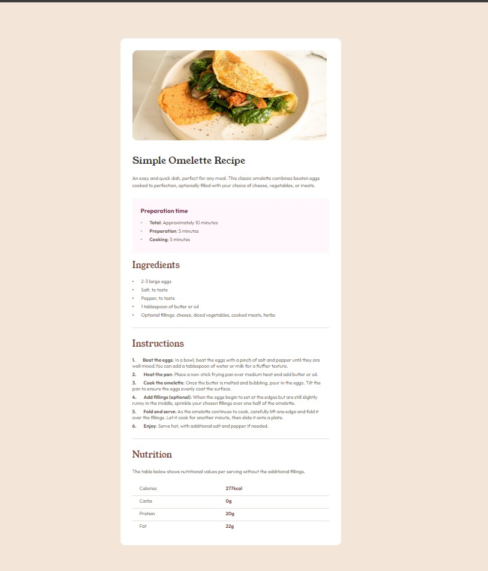

## Índice
- [Índice](#índice)
- [Visão geral](#visão-geral)
  - [Screenshot](#screenshot)
  - [Links](#links)
- [My process](#my-process)
  - [Built with](#built-with)
- [Author](#author)

## Visão geral
### Screenshot

### Links
- Live Site URL: [Acesse](https://maahbatistaa.github.io/frontend-mentor/recipe-page/)

## My process

### Built with

- Marcação semântica HTML5
- Propriedades personalizadas do CSS

## Author

- Website - [Mariana Batista](https://maahbatistaa-portfolio.vercel.app)
- Frontend Mentor - [@maahbatistaa](https://www.frontendmentor.io/profile/maahbatistaa)

